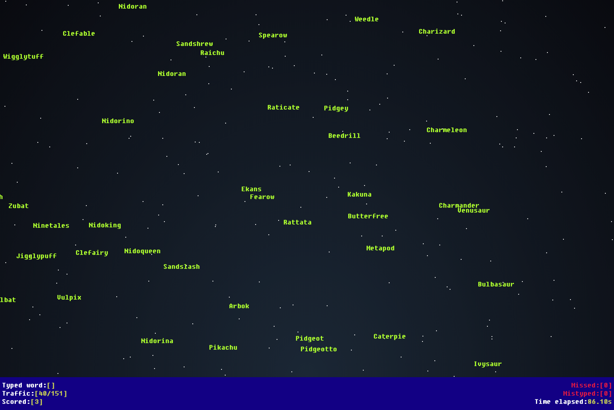

# WordSmasher

A simple game that can help you improve your keyboard writing skills and help you memorize new words.



## Directory structure
`public/` this directory contains all public assets

`src/assets` this directory contains all game assets

`src/components` this directory contains all `VueJS Components` 

The [Vue CLI](https://cli.vuejs.org/) was used for the directory structure. 

## Adding a new dictionary
To add a new `dictionary` create a JSON file within the directory `public/dictionaries/` and write down all the words as a JSON array. 

Review other dictionaries as reference. 

Next, open the file `public/dictionaries/dictionaries.json` and append your dictionary data to it.

```
  {
    "name": "The name of the dictionary",
    "file": "the_name_of_the_file.json",
    "words": [], // Leave empty
    "numberOfWords": 10, // the number of words found in the dictionary
    "selected": false // Leave false
  }
```  

## Project setup
```
yarn install
```

### Compiles and hot-reloads for development
```
yarn serve
```

### Compiles and minifies for production
```
yarn build
```

### Lints and fixes files
```
yarn lint
```

### Customize configuration
See [Configuration Reference](https://cli.vuejs.org/config/).

#### Demo
[Play Here!](https://word-smasher.sprigs.eu)

### Credits

-   SFX by SubspaceAudio (https://opengameart.org/content/512-sound-effects-8-bit-style)
-   Music by author on OpenGameArt (update readme if you find the author)
-   Inspired by WSpeed (https://bisqwit.iki.fi/wspeed/)
-   NickyCase with her awesome games


Made with ❤️ in Kosovo